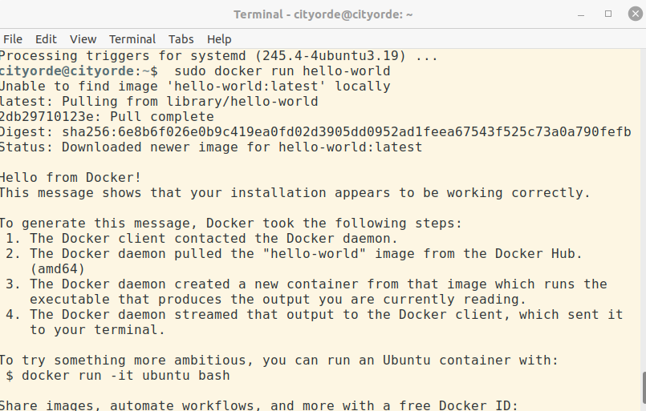
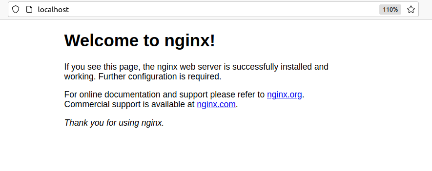
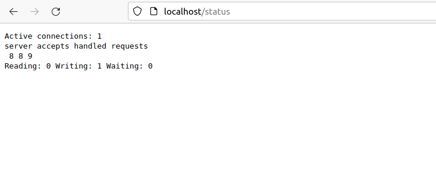
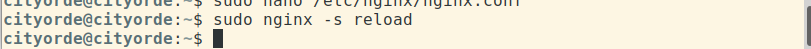

## Part 1. Готовый докер

Прежде всего установим Docker Engine по инструкции с официального сайта (https://docs.docker.com/engine/install/ubuntu/)

И проверим его работоспособность, запустив команду sudo docker run hello-world (скачивает контейнер, запускает его и мы видим приветствие)

#### Взять официальный докер образ с nginx и выкачать его при помощи docker pull

#### Проверить наличие докер образа через docker images

#### Запустить докер образ через docker run -d [image_id|repository]

#### Проверить, что образ запустился через docker ps

#### Посмотреть информацию о контейнере через docker inspect [container_id|container_name]

#### По выводу команды определить и поместить в отчёт размер контейнера, список замапленных портов и ip контейнера

#### Остановить докер образ через docker stop [container_id|container_name]

#### Проверить, что образ остановился через docker ps

#### Запустить докер с замапленными портами 80 и 443 на локальную машину через команду run

#### Проверить, что в браузере по адресу localhost:80 доступна стартовая страница nginx

#### Перезапустить докер контейнер через docker restart [container_id|container_name]

#### Проверить любым способом, что контейнер запустился

## Part 2. Операции с контейнером

#### Прочитать конфигурационный файл nginx.conf внутри докер контейнера через команду exec

#### Создать на локальной машине файл nginx.conf

#### Настроить в нем по пути /status отдачу страницы статуса сервера nginx

#### Скопировать созданный файл nginx.conf внутрь докер образа через команду docker cp

#### Перезапустить nginx внутри докер образа через команду exec

#### Проверить, что по адресу localhost:80/status отдается страничка со статусом сервера nginx

#### Экспортировать контейнер в файл container.tar через команду export

#### Остановить контейнер

#### Удалить образ через docker rmi [image_id|repository], не удаляя перед этим контейнеры

#### Удалить остановленный контейнер

#### Импортировать контейнер обратно через команду import

#### Запустить импортированный контейнер

#### Проверить, что по адресу localhost:80/status отдается страничка со статусом сервера nginx

## Part 3. Мини веб-сервер

#### Написать мини сервер на C и FastCgi, который будет возвращать простейшую страничку с надписью Hello World!

Устанавливаем библиотеку FastCgi

Пишем сервер на Си
(rtfm.sgu.ru/apache/asgxc.htm)

И собираем его

#### Запустить написанный мини сервер через spawn-fcgi на порту 8080

Устанавливаем spawn-fcgi

И запускаем наш сервер на порту 8080

#### Написать свой nginx.conf, который будет проксировать все запросы с 81 порта на 127.0.0.1:8080

Меняем содержимое /etc/nginx/nginx.conf

Перезапускаем nginx

#### Проверить, что в браузере по localhost:81 отдается написанная вами страничка

#### Положить файл nginx.conf по пути ./nginx/nginx.conf (это понадобится позже)

## Part 4. Свой докер

#### Написать свой докер образ, который:

1) собирает исходники мини сервера на FastCgi из Части 3

2) запускает его на 8080 порту

3) копирует внутрь образа написанный ./nginx/nginx.conf

4) запускает nginx.
nginx можно установить внутрь докера самостоятельно, а можно воспользоваться готовым образом с nginx'ом, как базовым.

Для сборки не хватало mime.types файла. Добавим его к файлу nginx.conf

#### Собрать написанный докер образ через docker build при этом указав имя и тег

Проверить через docker images, что все собралось корректно

#### Запустить собранный докер образ с маппингом 81 порта на 80 на локальной машине и маппингом папки ./nginx внутрь контейнера по адресу, где лежат конфигурационные файлы nginx'а (см. Часть 2)

#### Проверить, что по localhost:80 доступна страничка написанного мини сервера

#### Дописать в ./nginx/nginx.conf проксирование странички /status, по которой надо отдавать статус сервера nginx

#### Перезапустить докер образ

Если всё сделано верно, то, после сохранения файла и перезапуска контейнера, конфигурационный файл внутри докер образа должен обновиться самостоятельно без лишних действий

#### Проверить, что теперь по localhost:80/status отдается страничка со статусом nginx

## Part 5. Dockle

Установим Dockle по инструкции (https://habr.com/ru/company/timeweb/blog/561378/)

#### Просканировать образ из предыдущего задания через dockle [image_id|repository]

Восползуемся расшифровкой ошибок (https://github.com/goodwithtech/dockle/blob/master/README.md)

#### Исправить образ так, чтобы при проверке через dockle не было ошибок и предупреждений

Исправляем Dockerfile

Собираем образ

Проверяем с помощью Dockle

Ошибок и предупреждений нет. Осталось информирование. Его рекомендации соблюдены, проблема в свежей версии Dockle.

## Part 6. Базовый Docker Compose

Установим docker-compose

#### Написать файл docker-compose.yml, с помощью которого:

1) Поднять докер контейнер из Части 5 (он должен работать в локальной сети, т.е. не нужно использовать инструкцию EXPOSE и мапить порты на локальную машину)

2) Поднять докер контейнер с nginx, который будет проксировать все запросы с 8080 порта на 81 порт первого контейнера

#### Замапить 8080 порт второго контейнера на 80 порт локальной машины

#### Остановить все запущенные контейнеры

#### Собрать и запустить проект с помощью команд docker-compose build и docker-compose up

Собираем

Запускаем. Ошибка.

Необходимо добавить файл /run/nginx.pid и дать ему права

Запускаем еще раз

#### Проверить, что в браузере по localhost:80 отдается написанная вами страничка, как и ранее

В терминале появляются логи 

